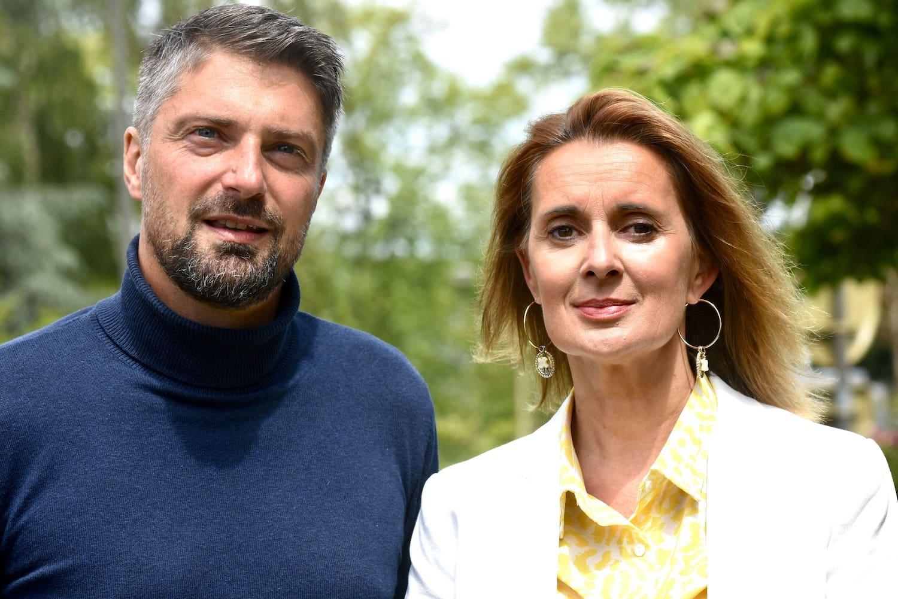

<meta property="og:title" content="Jérémy Dauphin — Nouveau Front Populaire" />
<meta property="og:description" content="Le 30 juin et le 7 juillet, votez Jérémy Dauphin et Stéphanie Méal, pour le Nouveau Front Populaire." />
<meta property="og:image" content="https://dinandivercite.fr/2024/og_elections.jpg" />
<link rel="icon" type="image/png" href="https://dinandivercite.fr/2024/favicon.png" />

<header>
  

    
  

  

    <h1>Le 30 juin et le 7 juillet, votez Jérémy Dauphin !</h1>
  

</header>

<section class="entete">
  

  
Élections législatives des 30 juin et 7 juillet 2024 - 2e circonscription des Côtes d’Armor (Dinan)

    

    

      

        <a href="#programme" class="btn">Notre programme</a>
      

      

        <a href="#procuration" class="btn">Faire une procuration</a>
      

      

        <a href="#contact" class="btn">Nous contacter</a>
      

    

  

</section>

<section id="programme">
  

    <h2>Notre programme</h2>

    <h3>100 jours pour tout changer avec le Nouveau Front Populaire</h3>

    <ul>
      <li>
        Pour notre pouvoir d’achat et les droits sociaux
      </li>
      <li>
        Pour la démocratie et l’égalité entre toutes et tous
      </li>
      <li>
        Pour notre santé et nos services publics
      </li>
      <li>
        Pour le vivant et le climat
      </li>
      <li>
        Pour la relocalisation des industries et des emplois
      </li>
      <li>
        Pour la paix partout, en Ukraine et à Gaza
      </li>
    </ul>

    

      

        <a href="https://www.nouveaufrontpopulaire.fr/" class="btn">Voir le programme en détail</a>
      

      

        <a href="#candidature" class="btn">Nos candidats</a>
      

    

  

</section>

<section id="candidature">
  

    <article>
      

        <!-- Ci-dessous la photo de votre candidat·e -->
        
      

      

        <h2>Jérémy Dauphin</h2>

        <!-- Ci-dessous 3 points à retenir sur votre candidat·e (faire court !) -->
        <ul>
          <li>
            Co-gérant de la Société Coopérative d'Intérêt Collectif "Énergies Renouvelables Pays de Rance"
          </li>
          <li>
            Maire de Languédias, adhérent du réseau Bruded, Vice-Président de Dinan Agglomération en charge de la Culture, des Sports et de la Citoyenneté.
          </li>
          <li>
            41 ans et père de 2 enfants
          </li>
        </ul>
      
        <!-- Ci-dessous un petit texte reprenant 2 ou 3 mesures nationales en les déclinant sur les impacts locaux. -->
        
Présent et investi depuis toujours sur le territoire, je suis ingénieur agricole de formation. En 2008, avec un collectif engagé, nous avons créé une coopérative autour de la filière bois.

        
Tous les jours sur le terrain, auprès des agriculteurs, des élus, des citoyens nous travaillons pour une écologie pragmatique et concertée. Maire de Languédias depuis 10 ans, j'ai pu, avec les équipes municipales, les agents, la population, transformer notre village en y recréant du lien, des festivités, des commerces, des logements, des espaces de loisirs pour la jeunesse, tout en protégeant notre cadre de vie et notre environnement.

        
Vice-Président de Dinan Agglomération je m'implique tous les jours pour développer et diffuser la culture et le sport pour tou.te.s et partout.

        
Fort de tous ces engagements et expériences concrètes, je mettrai mon énergie et mes compétences au service de notre pays et de notre belle circonscription.

            
<strong>Comptez sur moi pour réparer nos services publics, relever les défis de l'urgence sociale et du climat. Retrouvons ainsi le chemin de l'apaisement.</strong>

      

    </article>
  
    <article>
      

        <!-- Si besoin car non présent·e sur la 1e photo, ci-dessous la photo de votre suppléant·e -->
        
      

      

        <h2>Stéphanie Méal - remplaçante</h2>

        <!-- Ci-dessous 3 points à retenir sur votre remplaçant·e (faire court !) -->
        <ul>
          <li>
            Professeure des écoles
          </li>
          <li>
            Adjointe à la ville de Dinan en charge des services aux habitants et de l'inclusion
          </li>
          <li>
            49 ans et maman de 2 enfants
          </li>
        </ul>

        <!-- Ci-dessous un petit texte reprenant 2 ou 3 mesures nationales en les déclinant sur les impacts locaux. -->
        
Je suis depuis toujours attachée aux valeurs de liberté et de justice que je retrouve après avoir cru au mirage macronien.

      

    </article>
  

</section>

<section id="contact">
  

    <h2>Nous contacter</h2>
    
Écrivez-nous à <a href="mailto:contact@frontpopulaire22-02.fr">contact@frontpopulaire22-02.fr</a>

  

</section>

<section class="logos_partis">
  

    <h2>L'union de la gauche, c'est le Nouveau Front Populaire !</h2>

    <ul>
      <li>
          
      </li>
      <li>
        
      </li>
      <li>
        
      </li>
      <li>
        
      </li>
    </ul>

    
avec le soutien de Dinan Diver'cité, Place publique, Génération.s, GES, GRS, MRC, LRDG, L'engagement, GDS, Ensemble !, Parti de gauche, Picardie Debout, PEP, Révolution Écologique pour le Vivant (REV), Allons enfants, ADS, Nouvelle Donne, La Jeune Garde, Union démocratique bretonne (UDB), ESNT 

  

</section>

<section id="procuration">
  

    
Vous ne pouvez pas vous déplacer le 30&nbsp;juin ou le 7&nbsp;juillet prochain ?

  
    <h2>Votez par procuration</h2>
  
    
Contactez nous à l’adresse <a href="mailto:contact@frontpopulaire22-02.fr">contact@frontpopulaire22-02.fr</a> en nous indiquant votre nom, la commune dans lequel vous votez, si c’est pour le 1er ou 2e tour ou les deux, et nous vous mettrons en relation avec un électeur avec qui vous pourrez faire une procuration.

    

      

        <a href="#contact" class="btn">Nous contacter</a>
      

    

  

</section>

<section id="inscription">
  

    <h2>Votre bureau de vote</h2>

    <ul>
      <li>Vous ne savez pas quel est votre bureau de vote ?</li>
      <li>Vous n'êtes pas sûr·es d'être inscrit·e ?</li>
    </ul>

    
Retrouvez vos informations pour <strong>voter les 30 juin et 7 juillet</strong> sur <a href="https://www.service-public.fr/particuliers/vosdroits/R51788">Service-Public.fr</a>

  

</section>

<section class="villes">
  

    
    
    <h2>Le 30&nbsp;juin et le 7&nbsp;juillet, votez et faites voter autour de vous !</h2>
    
    <!-- Ci-dessous listez les villes de votre circonscription pour aider les moteurs de recherche à trouver votre site -->
    
Que vous soyez électeur ou électrice à Aucaleuc, Bobital, La Bouillie, Bourseul, Broons, Brusvily, Caulnes, Calorguen, La Chapelle-Blanche, Les Champs-Géraux, Corseul, Créhen, Dinan-Léhon, Éréac, Erquy, Évran, Fréhel, Gomené, Guenroc, Guitté, Hénanbihen, Le Hinglé, Illifaut, Landébia, La Landec, Languédias, Languenan, Lanrelas, Lanvallay, Laurenan, Loscouët-sur-Meu, Matignon, Mégrit, Merdrignac, Mérillac, Plancoët, Planguenoual, Pléboulle, Plélan-le-Petit, Pléneuf-Val-André, Pleudihen-sur-Rance, Pléven, Plévenon, Plorec-sur-Arguenon, Plouasne, Pluduno, Plumaudan, Plumaugat, Plurien, Quévert, Le Quiou, Rouillac, Ruca, Saint-Alban, Saint-André-des-Eaux, Saint-Carné, Saint-Cast-le-Guildo, Saint-Denoual, Saint-Hélen, Saint-Jacut-de-la-Mer, Saint-Jouan-de-l'Isle, Saint-Judoce, Saint-Juvat, Saint-Launeuc, Saint-Lormel, Saint-Maden, Saint-Maudez, Saint-Méloir-des-Bois, Saint-Michel-de-Plélan, Saint-Pôtan, Saint-Vran, Sévignac, Trébédan, Trédias, Tréfumel, Trélivan, Trémeur, Trémorel, Trévron, Vildé-Guingalan, Yvignac-la-Tour… chaque vote compte pour empêcher l'extrême-droite d'arriver au pouvoir !

  

</section>

<section class="footer">
    Candidature du Nouveau Front Populaire - 2e circonscription des Côtes d'Armor (Dinan).
</section> 